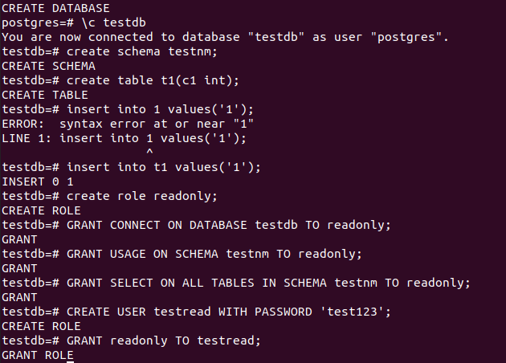
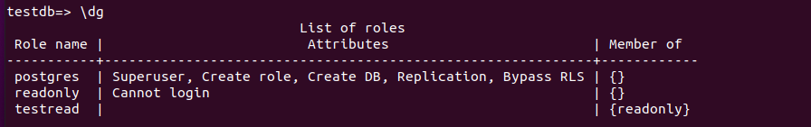
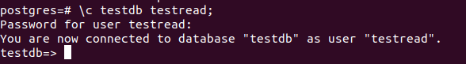
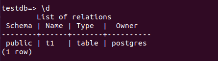
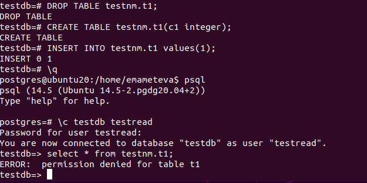
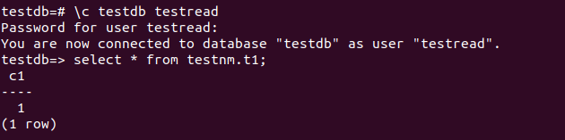
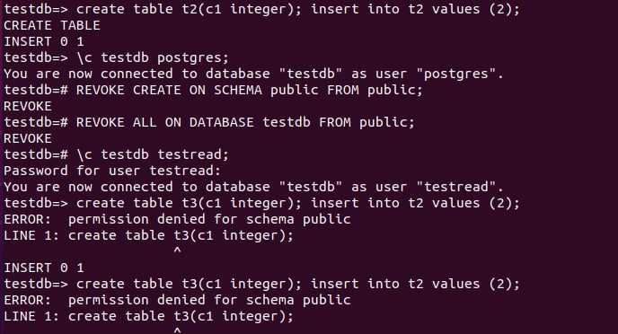

* У нас кластер postgresql14 (14 main).
* Cоздаем тестовую БД testdb.
* Создаем схему testnm
* Создаем таблицу t1 с одной колонкой с1, заполняем одну строку.
* Создаем роль readonly, даем права на подключение (CONNECT), на использование схемы (USAGE), на select (ALL TABLES IN SCHEMA testnm).

* Создаем роль testread с паролем и включаем ее в readonly.

* Заходим в testdb пользователем testread. Пробуем select. Не получается т.к. у нас права на схему testnm, а таблица t1 в другой.

* У нас стояла схема public по умолчанию, ни при создании БД ни при создании таблицы.
* Пересоздаем таблицу t1, уже указывая схему - testnm.t1.
* Но под пользователем testread так же нет доступа к чтению таблицы.

* Т.к. мы дали права на уже созданные таблицы а t1 была перезаписана.
* Настраиваем доступ с учетом создаваемых в будущем объектов для роли readonly. ALTER DEFAULT PRIVILEGES позволяет задавать права, применяемые к объектам, которые будут создаваться в будущем.
* select работает

* Далее пробуем создать таблицу t2 пользователем testread. Создалась успешно. Создалась в схеме public (по уполчанию, по searh_path). И роль public добавляется всем новым пользователям (на создание, чтение в этой схеме).
* Лучше лишить роль public этих привилегий. Тогда в создании таблицы будет отказано, т.е. у самой роли public не будет этих прав.

